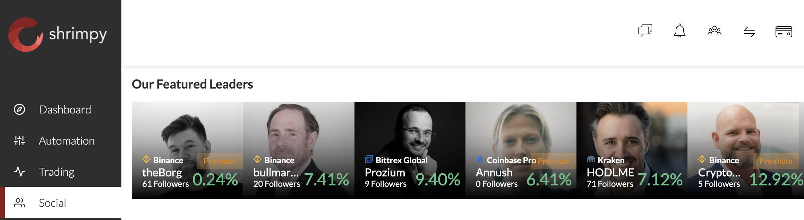

# Shrimpy GO API Client
Welcome to shrimpy-go. This project is an unofficial client for Shrimpy's personal account management API. For more information about the API please see the documentation at https://dashboard.shrimpy.io/docs/#introduction.

## Usage

An example program has been included to demonstrate how to use the client to retrieve a list of exchange accounts managed by your Shrimpy profile. Follow the directions to run the sample:

```
➜  shrimpy-go git:(master) ✗ export SHRIMPY_URL=https://api.shrimpy.io
➜  shrimpy-go git:(master) ✗ export SHRIMPY_KEY=<API Key>
➜  shrimpy-go git:(master) ✗ export SHRIMPY_SECRET=<API Secret>
➜  shrimpy-go git:(master) ✗ go run example/main.go
```
## About the author

I am HODLME, a popular featured leader on Shrimpy's social trading platform. This library is a small part of my proprietary account trading software. I am releasing it for public use in support of the Shrimpy community. For more information on my trading strategy and results, please see my Shrimpy leader profiles:

- Kraken - https://dashboard.shrimpy.io/leader/hodlme
- Coinbase Pro - https://dashboard.shrimpy.io/leader/goalaska

